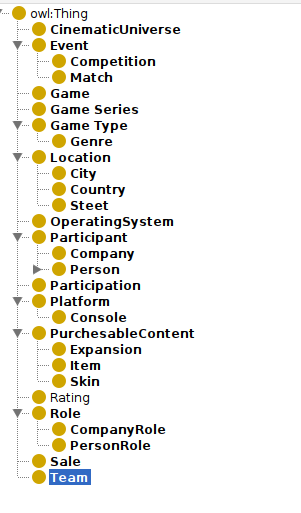

# Advanced Ontology Engineering
30 classes, 25 properties. Use owl2 properties and ontology design patterns. 

## Ontology development 101 steps
According to [Ontology Development 101: A Guide to Creating Your First Ontology](https://protege.stanford.edu/publications/ontology_development/ontology101.pdf)
### Step 1. Determine the domain and scope of the ontology
Domain: **Video Games**
Sample questions we would like to answer:
- What video games did a company develop
- What games were released in year x
- What are the best-selling video games?
- How many characters are there in a game?
- What are the sequels/prequels of a game?
- Is this game part of a series?
- Is this series part of a universe?
- Who holds the record for x in game y
- Who is the best player of game x
- What was the esports competition with the biggest prize?
- ...
  
### Step 2. Existing ontologies:
Are there any already existing ontologies? 
1. [Video game ontology](https://vocab.linkeddata.es/vgo/) 
2. [Corporations and their products ontology](https://spec.edmcouncil.org/fibo/ontology/BE/LegalEntities/FormalBusinessOrganizations/)

### Step 3. Enumerate essential terms in the ontology

Game, title, description, release date, game series, cinematic universe, platform, game_url

Game type -> single player, mutiplayer, competitive, genre -> RPG, MMORPG, ..., 

Game product (anything for sale in game) -> skin, item, expansion, ...

Company, company title, company country, number of employees, publisher, developer

rating, number of ratings, score, completion

Character, character name,

event, leaderboard, record, competition, team, prize, score, match

person, lead developer, art director, composer, voice actor, player (in the context of esport team) ...

part of, developed, owns, availableOn (platform), competed in, worked on, published, for sale, won, lost, 

### Step 4. Define the classes and the class hierarchy

### Step 5. Define the properties of classes—slots
### Step 6. Define the facets of the slots

## OWL2 Feautres
During ontology engineering, make use of the advanced modelling features offered
by OWL2 (refer to lecture 2).

## Ontology Design Patterns
Additionally, illustrate the use of at least 3 different Ontologies
Design Patterns (ODPs). These can be selected from those described during the lecture or
from the ODP [website](http://ontologydesignpatterns.org/wiki/Main_Page)

- part of design patern

## Data Sources
We use the following two data sources

### PlayMyData
PlayMyData is a multi-purpose, comprehensive videogame dataset of videogames released from 1993 up to November 2023. It contains metadata like titles, platforms, a summary of the story, and release data. It also integrates data from HowLongToBeat on completion times.
https://huggingface.co/datasets/claudioDsi94/PlayMyData

### IGDB Games
[https://api-docs.igdb.com/](https://api-docs.igdb.com/)

### freetogame
[https://www.freetogame.com/](https://www.freetogame.com/)
